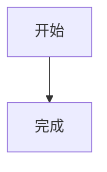

# Astro 新站使用指南

本文档适用于当前 `Terminal 4` 项目，说明如何创建和维护 Blog、Review、Gallery、About 页面，以及如何配置图片、Markdown、主题和网站信息。

## 1. 环境与常用命令

环境要求：

- Node.js 22.12+
- pnpm 10+

首次安装依赖：

```bash
pnpm install
```

后台启动开发服务器：

```bash
pnpm astro dev --background
```

管理后台服务：

```bash
pnpm astro dev status
pnpm astro dev logs
pnpm astro dev stop
```

生产构建：

```bash
pnpm build
```

构建结果位于 `dist/`。

## 2. 主要目录

```text
src/
├─ content/
│  ├─ blog/       博客文章
│  ├─ reviews/    Review 内容
│  ├─ gallery/    Gallery 元数据
│  ├─ memos/      短动态
│  └─ pages/      About 页面 Markdown 正文
├─ image/
│  ├─ blog/       新博客文章图片，由 Typora 管理
│  └─ gallery/    Gallery 图片，由创建命令导入
├─ pages/          Astro 页面与路由
├─ styles/         全局与 Markdown 样式
└─ consts.ts       网站主要配置

public/
├─ images/         旧博客文章图片
├─ reviews/        Review 封面图片
└─ gallery/        旧 Gallery 图片，保留用于兼容
```

内容字段由 `src/content.config.ts` 统一校验。字段拼错、类型不正确或缺少必填字段时，构建会报错。

## 3. 创建 Blog 文章

执行：

```bash
pnpm new:post "文章名称"
```

将生成：

```text
src/content/blog/文章名称.md
```

脚本不会覆盖同名文件。只检查目标而不创建文件：

```bash
pnpm new:post "文章名称" --dry-run
```

默认模板：

```md
---
title: "文章名称"
description: ""
date: 2026-08-08
tags: []
sticky: 0
draft: true
toc: true
mathjax: false
mermaid: false
donate: true
comment: true
---

Write the article here.
```

### Blog 字段

| 字段 | 必填 | 说明 |
|---|---:|---|
| `title` | 是 | 页面标题 |
| `date` | 是 | 建议使用 `YYYY-MM-DD` |
| `description` | 否 | 搜索、SEO 与分享摘要 |
| `tags` | 否 | 标签数组，例如 `[Astro, Java]` |
| `sticky` | 否 | 置顶权重，数字越大越靠前 |
| `draft` | 否 | 是否为草稿 |
| `toc` | 否 | 是否显示目录 |
| `mathjax` | 否 | 是否加载 MathJax |
| `mermaid` | 否 | 是否加载 Mermaid |
| `donate` | 否 | 是否允许显示赞赏区域 |
| `comment` | 否 | 是否允许显示评论区域 |
| `ogImage` | 否 | 社交分享图片 |

当前 Blog 没有 `category`、`categories` 或 `abbrlink` 功能。旧文章中这些字段不会参与页面分类，新内容应使用 `tags`。

文章文件名会成为 URL，例如：

```text
src/content/blog/Astro指南.md
→ /blog/astro指南
```

### Blog 草稿行为

- 本地开发时，Blog 的 `draft: true` 文章仍然显示，方便预览。
- 执行生产构建时，Blog 草稿会被排除。

## 4. Typora 与 Blog 图片

新文章图片约定放在：

```text
src/image/blog/文章名称/
```

例如：

```text
src/content/blog/Astro指南.md
src/image/blog/Astro指南/首页.png
```

在 Markdown 中引用：

```md

```

Typora 可以将当前文章的图片复制目标配置为：

```text
../../image/blog/${filename}/
```

实际变量写法以当前 Typora 版本支持的规则为准。创建 Blog 的命令只创建 `.md` 文件，图片目录由 Typora 在插图时管理。

旧文章仍可以继续使用：

```text
public/images/JVM/1.png
```

对应 Markdown：

```md

```

## 5. 创建 Review

默认创建游戏 Review：

```bash
pnpm new:review "作品名称"
```

指定类型：

```bash
pnpm new:review "作品名称" --type anime
```

可用类型全部使用英文内部标识：

```text
game
anime
movie
video
book
```

安全预演：

```bash
pnpm new:review "作品名称" --type movie --dry-run
```

生成位置：

```text
src/content/reviews/作品名称.md
```

默认格式：

```md
---
title: "作品名称"
date: 2026-08-08
type: game
status: completed
creator: ""
summary: ""
notes: []
tags: []
draft: true
---

Write the final review here.
```

完整示例：

```md
---
title: "Death Stranding"
date: 2026-08-08
type: game
status: completed
rating: 8.8
cover: /reviews/death-stranding.png
creator: Hideo Kojima
summary: A long and quiet journey about distance and connection.
notes:
  - date: Chapter 3
    text: The slow rhythm starts to feel deliberate.
  - date: Final chapter
    text: The emotional payoff makes the journey worthwhile.
tags: [journey, sample]
draft: false
---

这里写完整的最终 Review。
```

Review 封面可放在：

```text
public/reviews/death-stranding.png
```

然后填写：

```yaml
cover: /reviews/death-stranding.png
```

`rating` 可省略；填写时必须在 `0` 到 `10` 之间。Review 的 `draft: true` 在开发和生产环境都会被页面过滤。

## 6. 创建 Gallery

Gallery 使用“导入图片并同时生成内容”的方式。

原创作品：

```bash
pnpm new:gallery "作品名称" --image "D:/Pictures/artwork.png" --kind oc
```

同人作品：

```bash
pnpm new:gallery "作品名称" --image "D:/Pictures/artwork.png" --kind fanart
```

添加替代文字：

```bash
pnpm new:gallery "作品名称" --image "D:/Pictures/artwork.png" --kind fanart --alt "作品画面说明"
```

安全预演：

```bash
pnpm new:gallery "作品名称" --image "D:/Pictures/artwork.png" --kind oc --dry-run
```

命令会自动：

1. 检查源图片是否存在。
2. 将图片复制到 `src/image/gallery/作品名称.扩展名`。
3. 创建 `src/content/gallery/作品名称.md`。
4. 自动填写标题、日期、类型、图片路径和 alt。
5. 设置 `draft: true`。
6. 在构建时交给 Astro 优化图片。

允许的图片格式：

```text
avif gif jpeg jpg png svg webp
```

Gallery 内部类型只使用：

```text
oc
fanart
```

页面显示为 `OC` 和 `FAN ART`。请不要在 frontmatter 中写 `OC`、`同人` 或其他值。

生成格式：

```md
---
title: "作品名称"
date: 2026-08-08
kind: oc
tags: []
image: ../../image/gallery/作品名称.png
alt: "作品名称"
draft: true
---

Write the artwork description here.
```

发布前将：

```yaml
draft: true
```

改为：

```yaml
draft: false
```

Gallery 命令不会覆盖已经存在的 Markdown 或目标图片。当前 Gallery 页面只显示图片、标题、类型和标签，Markdown 正文暂未显示在页面上。

## 7. 编辑 About 页面

页面布局仍由 Astro 管理，经常修改的正文已经迁移到 Markdown。

“关于我”正文：

```text
src/content/pages/about.md
```

“关于本站”正文：

```text
src/content/pages/site.md
```

格式：

```md
---
title: About me
description: A personal introduction.
---

这里直接写 Markdown 正文。

## 标题

- 列表内容
- 其他内容
```

对应的 Astro 布局和局部样式位于：

```text
src/pages/about/index.astro
src/pages/site/index.astro
```

一般编辑文字时只修改 `src/content/pages/*.md`。需要改变页面结构、卡片样式或响应式布局时，再修改对应 `.astro` 文件。

## 8. Markdown 支持

项目支持常用 GitHub Flavored Markdown：

- 标题、段落和引用
- 粗体、斜体、删除线
- 有序和无序列表
- 任务列表
- 链接和图片
- 表格
- 脚注
- 行内代码与代码块
- 原生 HTML
- `.mdx`

代码块由 Expressive Code 渲染，支持语法高亮、行号和长代码折叠。自动折叠行数在 `src/consts.ts` 修改：

```ts
codeFoldingStartLines: 16
```

### MathJax

Blog frontmatter：

```yaml
mathjax: true
```

正文：

```md
行内公式：$E = mc^2$

$$
a^2 + b^2 = c^2
$$
```

### Mermaid

Blog frontmatter：

```yaml
mermaid: true
```

正文：

````md

````

MathJax 与 Mermaid 当前通过外部 CDN 加载，离线或 CDN 不可用时无法正常显示。这两个开关目前只接入 Blog 文章布局。

### 提示块

```md
:::note[说明]
这里是说明内容。
:::

:::tip[提示]
这里是提示内容。
:::

:::caution[注意]
这里是注意事项。
:::

:::danger[危险]
这里是危险提示。
:::
```

折叠块：

```md
:::collapse[点击展开]
这里是折叠内容。
:::
```

Markdown 插件配置位于 `astro.config.js`。

## 9. Markdown 样式

主要样式文件：

```text
src/styles/github-markdown.css
```

这里控制标题、段落、引用、表格、列表、代码和 Markdown 深浅色变量。

项目的额外覆盖位于：

```text
src/styles/index.css
```

例如：

```css
.markdown-body p {
  line-height: 1.8;
}

.markdown-body img {
  margin: 1.5rem auto;
  border-radius: 12px;
}
```

提示块样式位于：

```text
src/styles/remark-aside.css
```

## 10. 网站信息、导航和功能配置

主要配置入口：

```text
src/consts.ts
```

常修改内容：

```ts
export const site = {
  title: 'Terminal 4',
  description: '文章、随想、作品与生活记录。',
  author: 'zennnj',
  avatar: '/images/lol.jpg',
  url: 'https://zennnj.github.io',
  baseUrl: '',
  motto: '列車は必ず次の駅へ',
}
```

同一文件中还包含：

- 导航菜单 `categories`
- 社交链接 `infoLinks`
- 赞赏配置 `donate`
- 评论配置 `comment`
- 统计配置 `analytics`
- 语言与代码折叠配置 `config`

如果部署在 GitHub Pages 的仓库子路径，例如 `https://name.github.io/repo/`，需要检查并设置：

```ts
baseUrl: '/repo'
```

## 11. 主题色与字体

主要主题变量在 `src/styles/index.css`。

语义颜色：

```css
--color-fill
--color-fill-secondary
--color-card
--color-text
--color-text-dodge
--color-text-active
--color-border
--color-border-active
--color-modal
```

新版页面布局颜色：

```css
--paper
--paper-deep
--ink
--purple
--purple-soft
--pink
```

当前主站浅色与深色变量基本相同，所以切换主题时主体颜色变化不明显。Markdown 区域在 `github-markdown.css` 中有独立的深浅色变量。

全站默认字体文件：

```text
src/styles/JetBrainsMono-Regular.ttf
```

注册和全局字体栈位于 `src/styles/index.css`。代码块字体在 `astro.config.js` 的 Expressive Code 配置中修改。

Review 页面有多处显式使用 `Georgia, serif`。如果要完全统一字体，还需要修改 `src/pages/reviews/` 中的局部样式。

## 12. 发布前检查

建议每次发布前执行：

```bash
pnpm build
```

检查：

- 新内容的 `draft` 是否已经改为 `false`
- Blog 图片相对路径是否正确
- Review `type` 是否为合法英文值
- Gallery `kind` 是否为 `oc` 或 `fanart`
- Gallery 原始图片是否成功复制到 `src/image/gallery/`
- 构建是否存在 schema 或图片错误
- 网站域名和 `baseUrl` 是否符合部署地址

代码块语言名不受支持时，Expressive Code 会退回纯文本并给出警告。例如旧文章中的 `Linux` 或 `mysql` 可能产生提示，但不会阻止构建。

## 13. 旧 Hexo 内容迁移

迁移脚本：

```text
scripts/migrate-hexo.mjs
```

它会从：

```text
D:/blog/source/_posts
```

导入旧文章和图片。带 `hidden` 或 frontmatter `password` 的旧文章会自动标记为草稿，避免意外公开。

不要在已有内容修改后随意重复执行迁移脚本，否则可能覆盖或重新生成迁移内容。执行前应先确认 Git 工作区状态并做好备份。

## 14. 相关文档

- Astro 文档：https://docs.astro.build
- 内容集合：https://docs.astro.build/zh-cn/guides/content-collections/
- Markdown：https://docs.astro.build/zh-cn/guides/markdown-content/
- 图片：https://docs.astro.build/zh-cn/guides/images/
- 样式：https://docs.astro.build/zh-cn/guides/styling/
- 路由：https://docs.astro.build/zh-cn/guides/routing/
