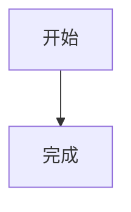

# Astro 新站使用指南

本文档适用于当前的 `Terminal 4` 项目，记录日常维护时最常用的内容入口。页面结构或配置发生变化后，应同步更新本文档与根目录的 `UI_STYLE_GUIDE.md`。

## 1. 环境与常用命令

环境要求：

- Node.js 22.12+
- pnpm 10+

首次安装依赖：

```bash
pnpm install
```

后台启动开发服务器：

```bash
pnpm astro dev --background
```

管理后台服务：

```bash
pnpm astro dev status
pnpm astro dev logs
pnpm astro dev stop
```

生产构建：

```bash
pnpm build
```

构建结果位于 `dist/`。路由配置为 `trailingSlash: "never"`，本地访问 ABOUT 页面时应使用 `/about`，而不是 `/about/`。

## 2. 项目中的主要维护入口

```text
src/
├─ config/
│  ├─ home.ts             首页文字、链接和图片
│  ├─ reviews.ts          Review 类型名称与分类色
│  └─ site.ts             ABOUT SITE 右侧结构卡片
├─ content/
│  ├─ blog/               Blog 文章
│  ├─ memos/              短动态
│  ├─ reviews/            Review
│  ├─ gallery/            Gallery 元数据
│  └─ pages/
│     ├─ about.md          ABOUT ME 正文与全部可配置内容
│     └─ site.md           ABOUT SITE 正文与全站更新日志
├─ image/
│  ├─ blog/               新 Blog 图片
│  └─ gallery/            Gallery 原图
├─ pages/                 Astro 页面、路由与页面局部样式
├─ styles/                全局主题与 Markdown 样式
├─ content.config.ts      内容集合字段校验
└─ consts.ts              站点信息、旧导航、评论和统计开关

public/assets/
├─ about/                 ABOUT ME 头像等资源
├─ fonts/                 本地字体
├─ home/hero/             首页首屏分层图片
├─ home/navigation/       首页导航图片、遮罩与描边
└─ ui/                    侧栏与 ASK 图标
```

`src/content.config.ts` 会校验所有内容字段。字段拼错、类型不正确或缺少必填字段时，`pnpm build` 会报错。

## 3. 创建 Blog 文章

执行：

```bash
pnpm new:post "文章名称"
```

生成位置：

```text
src/content/blog/文章名称.md
```

只检查、不创建文件：

```bash
pnpm new:post "文章名称" --dry-run
```

基本格式：

```md
---
title: "文章名称"
description: ""
date: 2026-08-10
tags: []
sticky: 0
draft: true
toc: true
mathjax: false
mermaid: false
donate: true
comment: true
---

在这里写正文。
```

### Blog 字段

| 字段          | 必填 | 说明                           |
| ------------- | ---: | ------------------------------ |
| `title`       |   是 | 页面标题                       |
| `date`        |   是 | 建议使用 `YYYY-MM-DD`          |
| `description` |   否 | 搜索、SEO 与分享摘要           |
| `tags`        |   否 | 标签数组，例如 `[Astro, Java]` |
| `sticky`      |   否 | 置顶权重，数字越大越靠前       |
| `draft`       |   否 | 是否为草稿                     |
| `toc`         |   否 | 是否显示目录                   |
| `mathjax`     |   否 | 是否加载 MathJax               |
| `mermaid`     |   否 | 是否加载 Mermaid               |
| `donate`      |   否 | 是否允许显示赞赏区域           |
| `comment`     |   否 | 是否允许显示评论区域           |
| `ogImage`     |   否 | 社交分享图片                   |

当前 Blog 没有 `category`、`categories` 或 `abbrlink` 功能，新文章分类使用 `tags`。

文件名会成为 URL。例如：

```text
src/content/blog/Astro指南.md
→ /articles/astro指南
```

本地开发时 Blog 草稿仍会显示，生产构建时会排除 `draft: true` 的 Blog。

## 4. Typora 与 Blog 图片

新文章图片约定放在：

```text
src/image/blog/文章名称/
```

Markdown 中使用相对路径：

```md

```

Typora 的图片复制目标可配置为：

```text
../../image/blog/${filename}/
```

旧文章仍可使用 `public/images/`：

```md

```

## 5. 创建 Memos

Memos 暂无创建脚本，在 `src/content/memos/` 中新建 Markdown：

```md
---
date: 2026-08-10
mood: 随手记
tags: [生活]
draft: false
---

这里写短动态正文。
```

可用字段为 `date`、`mood`、`tags` 和 `draft`。Memos 页面会渲染 Markdown 正文。

## 6. 创建 Review

默认创建游戏 Review：

```bash
pnpm new:review "作品名称"
```

指定类型：

```bash
pnpm new:review "作品名称" --type anime
```

可用类型：

```text
game
anime
movie
video
book
```

预演：

```bash
pnpm new:review "作品名称" --type movie --dry-run
```

完整示例：

```md
---
title: "Death Stranding"
date: 2026-08-10
type: game
status: completed
rating: 8.8
cover: /reviews/death-stranding.png
creator: Hideo Kojima
summary: A long and quiet journey about distance and connection.
notes:
  - date: Chapter 3
    text: The slow rhythm starts to feel deliberate.
  - date: Final chapter
    text: The emotional payoff makes the journey worthwhile.
tags: [journey, sample]
draft: false
---

这里写完整的最终 Review。
```

封面可以放在 `public/reviews/`。`rating` 可以省略；填写时必须在 0～10 之间。Review 的 `draft: true` 在开发和生产页面中都会被过滤。

Review 类型的显示名称与颜色统一配置在：

```text
src/config/reviews.ts
```

修改 `reviewTypeLabels` 会改变类型文字，修改 `reviewAccentColors` 会同时影响 Review 页面和 ABOUT ME 的 MY FAVORITE 彩色圆点。

## 7. 创建 Gallery

原创作品：

```bash
pnpm new:gallery "作品名称" --image "D:/Pictures/artwork.png" --kind oc
```

同人作品：

```bash
pnpm new:gallery "作品名称" --image "D:/Pictures/artwork.png" --kind fanart
```

增加替代文字和作品说明：

```bash
pnpm new:gallery "作品名称" --image "D:/Pictures/artwork.png" --kind fanart --tags "Celeste, fanart" --alt "图片替代文本" --description "作品说明"
```

预演：

```bash
pnpm new:gallery "作品名称" --image "D:/Pictures/artwork.png" --kind oc --dry-run
```

命令会复制图片到 `src/image/gallery/`，并在 `src/content/gallery/` 创建对应 Markdown。`--tag` 可重复指定单个标签，`--tags` 接受逗号分隔的多个标签并自动去重。`--alt` 用作图片替代文本，`--description` 写入弹窗显示的 Markdown 正文；省略 `--description` 时会沿用 `--alt`。允许的图片格式为 AVIF、GIF、JPEG、JPG、PNG、SVG 和 WebP。

Gallery 的 `kind` 只能填写：

```text
oc
fanart
```

创建脚本默认写入 `draft: false`，作品会直接参与生产构建；需要暂缓发布时手动改为 `draft: true`。创建脚本不会覆盖已存在的 Markdown 或目标图片。

## 8. 配置首页

首页常改内容集中在：

```text
src/config/home.ts
```

主要字段：

- `brand`：站点品牌文字。
- `hero`：首屏人物、贴纸、OMO 和标题图片。
- `contacts`：首屏联系方式。
- `navigation.heading`：首页导航区引语。
- `navigation.items`：ARTICLE、MEMOS、REVIEWS、GALLERY 的链接、图片、遮罩和描边。
- `about`：首页底部的独立 ABOUT 简介，不与 ABOUT ME 正文同步。
- `footer.navigation`：页脚导航。
- `footer.email`：ASK BOX 使用的收件邮箱。

首页资源路径约定：

```text
public/assets/home/hero/
public/assets/home/navigation/
```

每个导航卡片的 `image` 是可替换图片，`mask` 是裁切轮廓，`outline` 是手绘描边。只替换图片时优先修改配置，不要直接复制页面结构。

## 9. 配置 ABOUT ME

ABOUT ME 的内容统一放在：

```text
src/content/pages/about.md
```

文件分为两部分：

1. frontmatter：头像、播放器、联系方式、MY FAVORITE、OTHER 和折叠图片。
2. Markdown 正文：头像右侧的个人介绍。

完整结构示例：

```md
---
title: About me
description: 关于页面摘要
about:
  portrait: /assets/about/selfpic.png
  playlist:
    neteasePlaylistId: '17606083772'
    autoplay: false
  contacts:
    - name: GitHub
      href: https://github.com/zennnj
    - name: Email
      href: mailto:example@example.com
  favorites:
    - name: 黄金神威
      author: 野田悟
      category: anime
    - name: Kingdom Come: Deliverance
      category: game
  other:
    - label: 如果你想知道更多
      value: https://example.com
      href: https://example.com
    - label: 游戏账号
      value: example#1234
  fun:
    - title: 最近画了什么？
      description: 折叠栏中的说明。
      images:
        - /gallery/example-1.png
        - /gallery/example-2.png
---

hi，这里写介绍正文。

可以继续使用普通 Markdown 段落、列表和链接。
```

### 网易云歌单

`neteasePlaylistId` 填网易云歌单页面 URL 中的歌单 ID，不需要手写歌曲名和作者。当前使用网易云官方 `type=0` 外链播放器，高度为 450px，宽度会随页面自适应。

```yaml
playlist:
  neteasePlaylistId: '歌单ID'
  autoplay: false
```

浏览器可能阻止自动播放，即使 `autoplay: true` 也不能保证自动发声。iframe 内部属于网易云页面，本站 CSS 不能修改其中的字体、颜色、歌词或按钮，只能控制 iframe 的尺寸和外部布局。

### MY FAVORITE

- `name` 必填。
- `author` 可省略；填写后显示为较淡的括号文字。
- `category` 必须是 `game`、`anime`、`movie`、`video` 或 `book`。
- name 前圆点的颜色读取 `src/config/reviews.ts` 中对应分类色。
- 项目数量可以自由增减，后续区块会根据实际高度自动下移，不预留固定空间。

### SOMETHING FUN

`fun` 支持多个折叠分组，每组可以配置标题、说明和任意数量的图片。图片可以放在 `public/` 下，再从网站根路径引用。

ABOUT ME 的 Markdown 正文仍由页面 CSS 指定为“猫啃网烟波宋-B”，将内容迁入 Markdown 不会改变字体。布局与响应式样式位于：

```text
src/pages/about/index.astro
```

桌面端的介绍、CONTACT 链接、播放器和右侧各区块共用同一条起始轴；左侧小标题与头像左边缘对齐。

## 10. 配置 ABOUT SITE 与更新日志

ABOUT SITE 正文和全站更新日志位于：

```text
src/content/pages/site.md
```

示例：

```md
---
title: About this site
description: The story and structure of Terminal 4.
updates:
  - date: '2026-08-10'
    text: 更新 ABOUT 页面。
  - date: '2026-08-08'
    text: 迁移到 Astro。
---

这里直接写 ABOUT SITE 的 Markdown 正文。

## 本站使用的技术

- 框架：Astro
- 托管：Netlify
```

`updates` 是更新日志的唯一配置入口。修改这里以后，ABOUT SITE 和首页的 SITE UPDATE LOG 会同时更新，不要再去首页重复维护一份日志。

右侧 Current structure 卡片配置在：

```text
src/config/site.ts
```

其中 `structure` 的每一项包含 `label` 和 `description`。页面布局与 Markdown 样式位于 `src/pages/site/index.astro`。

## 11. Markdown 支持

项目支持常用 GitHub Flavored Markdown：

- 标题、段落和引用
- 粗体、斜体和删除线
- 有序、无序与任务列表
- 链接和图片
- 表格与脚注
- 行内代码和代码块
- 原生 HTML
- `.mdx`

代码块由 Expressive Code 渲染，支持语法高亮、行号和长代码折叠。自动折叠行数在 `src/consts.ts` 修改：

```ts
codeFoldingStartLines: 16
```

### MathJax

Blog frontmatter：

```yaml
mathjax: true
```

正文：

```md
行内公式：$E = mc^2$

$$
a^2 + b^2 = c^2
$$
```

### Mermaid

Blog frontmatter：

```yaml
mermaid: true
```

正文：

````md

````

MathJax 和 Mermaid 目前只接入 Blog 文章布局，并通过外部 CDN 加载。

### 提示块与折叠块

```md
:::note[说明]
这里是说明内容。
:::

:::tip[提示]
这里是提示内容。
:::

:::caution[注意]
这里是注意事项。
:::

:::danger[危险]
这里是危险提示。
:::

:::collapse[点击展开]
这里是折叠内容。
:::
```

Markdown 插件配置位于 `astro.config.js`，提示块样式位于 `src/styles/remark-aside.css`。

## 12. Markdown、颜色与字体样式

主要 Markdown 样式：

```text
src/styles/github-markdown.css
```

全局主题、页面补充样式和字体变量：

```text
src/styles/index.css
```

P4 主色变量：

```css
--p4-orange
--p4-purple
--p4-coral
--p4-gray
--p4-yellow
```

本地字体位于 `public/assets/fonts/`：

| CSS 变量            | 字体                        | 用途                        |
| ------------------- | --------------------------- | --------------------------- |
| `--font-title`      | PP Neue Montreal Bold       | 大标题                      |
| `--font-display`    | Boba Mono Regular           | 引语与展示文字              |
| `--font-body`       | Wix Madefor Display Regular | 正文、导航与小标题          |
| `--font-about-copy` | 猫啃网烟波宋-B Bold         | ABOUT ME 与 ABOUT SITE 正文 |

修改页面布局、颜色、字体、首页资源、侧栏或交互前，先阅读根目录 `UI_STYLE_GUIDE.md`。侧栏必须保持覆盖式打开，不能挤压或移动页面内容。

## 13. 站点信息、导航、评论与统计

旧模板和全站基础配置仍位于：

```text
src/consts.ts
```

其中包括：

- `site`：站点标题、描述、作者、域名、baseUrl、分页数量。
- `config`：语言、代码折叠和旧 Memos 服务参数。
- `categories`：全站导航数据。
- `infoLinks`：社交链接。
- `donate`：赞赏配置。
- `comment`：Waline / Giscus 配置。
- `analytics`：Umami、Google Analytics 和不蒜子开关。

如果部署在 GitHub Pages 仓库子路径，例如 `https://name.github.io/repo/`，需要设置：

```ts
baseUrl: '/repo'
```

当前首页的视觉导航和链接优先读取 `src/config/home.ts`；`src/consts.ts` 仍被其他传统页面与站点基础功能使用，两者用途不同。

## 14. Waline 图片上传与 OSS

Waline 评论组件位于：

```text
src/components/WalineComment.astro
```

线上环境通过 `netlify/functions/waline-proxy.mjs` 提供的 `/waline-api/*`
同源代理访问 Vercel 上的 Waline 服务，避免访客浏览器直接连接
`*.vercel.app`。localhost 开发环境通过 `astro.config.js` 中的 Vite 开发代理
把同一路径转发到已部署的 Netlify 站点，因此公司网络下的浏览器和本机
开发服务器都不会直接请求 Vercel 域名。

项目支持浏览器直传阿里云 OSS。签名由以下入口生成：

```text
netlify/functions/oss-upload-policy.mjs
```

本地开发时，同一路径由 `scripts/local-oss-policy-vite.mjs` 处理，不需要启动 Netlify CLI。

服务端常用环境变量：

```text
OSS_ACCESS_KEY_ID
OSS_ACCESS_KEY_SECRET
OSS_BUCKET
OSS_REGION
OSS_ENDPOINT
OSS_MAX_FILE_SIZE_MB
OSS_PUBLIC_BASE_URL
OSS_ALLOWED_ORIGINS
```

浏览器端开关：

```text
PUBLIC_OSS_UPLOAD_ENABLED=true
PUBLIC_OSS_MAX_FILE_SIZE_MB=5
```

不要给服务端密钥添加 `PUBLIC_` 前缀，也不要提交真实 AccessKey。完整的 Bucket CORS、RAM 最小权限和本地测试说明见：

```text
docs/WALINE_OSS.md
```

## 15. Netlify 部署

部署配置位于：

```text
netlify.toml
netlify/functions/
```

发布前需要在 Netlify 控制台配置生产环境变量。`dist/` 是静态输出目录，OSS 签名接口由 Netlify Function 提供。

## 16. 发布前检查

每次发布前执行：

```bash
pnpm build
```

检查：

- 新内容的 `draft` 是否已经改为 `false`。
- Blog 图片相对路径是否正确。
- Review `type` 是否为合法英文值。
- Gallery `kind` 是否为 `oc` 或 `fanart`。
- ABOUT ME 的网易云歌单 ID、图片路径和分类是否正确。
- ABOUT SITE 的更新日志是否只在 `site.md` 中维护。
- 首页替换图片是否保持 `image`、`mask`、`outline` 对应关系。
- 构建是否存在 schema 或图片错误。
- 正式域名、`site.url` 和 `baseUrl` 是否符合部署地址。
- Netlify 中的 OSS 环境变量和允许来源是否正确。
- 桌面端与手机端是否存在横向滚动。

代码块语言名不受支持时，Expressive Code 会回退为纯文本并发出警告。例如旧文章中的 `Linux` 或 `mysql` 可能产生提示，但不会阻止构建。

## 17. 旧 Hexo 内容迁移

迁移脚本：

```text
scripts/migrate-hexo.mjs
```

默认从以下位置导入旧文章和图片：

```text
D:/blog/source/_posts
```

带 `hidden` 或 frontmatter `password` 的旧文章会自动标记为草稿，避免意外公开。不要在已修改迁移结果后随意重复运行迁移脚本，否则可能覆盖或重新生成内容。执行前应确认 Git 工作区状态并做好备份。

## 18. 相关文档

- [Astro 文档](https://docs.astro.build)
- [内容集合](https://docs.astro.build/zh-cn/guides/content-collections/)
- [Markdown](https://docs.astro.build/zh-cn/guides/markdown-content/)
- [图片](https://docs.astro.build/zh-cn/guides/images/)
- [样式](https://docs.astro.build/zh-cn/guides/styling/)
- [路由](https://docs.astro.build/zh-cn/guides/routing/)
